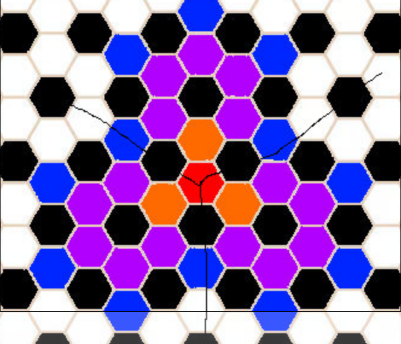
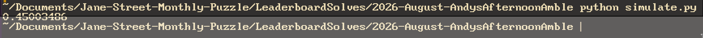

# My approach

## interpret the question

Here I have drawn out how I interpreted the question.
The red is home, the orange is on the ball and the blue is any square where Andy will realise he is not home. Since it it symmetric we can just focus on one of the thirds.

## forming the equation

$$
\begin{aligned}
a &= \frac{1}{3} + \frac{2}{3}b \\
b &= \frac{1}{3}a + \frac{1}{3}c \\
c &= \frac{1}{3}b + \frac{1}{3}d \\
d &= \frac{2}{3}c
\end{aligned}
$$

Where the letter is the distance from home (a = 1, b = 2, etc...).

## solving the equation 

this means there is a 45% chance he does not realise he has left the ball. Leaving the answer as 55% or 11/20

## safety test

I also decide to simulate it with python just as a double check of my maths and over 1,000,000 tries it evens out to very close to 0.45.

